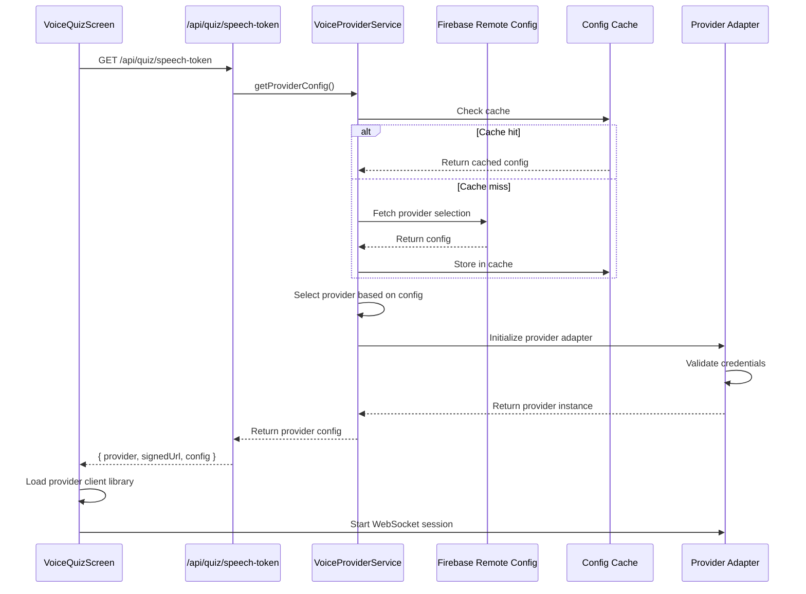
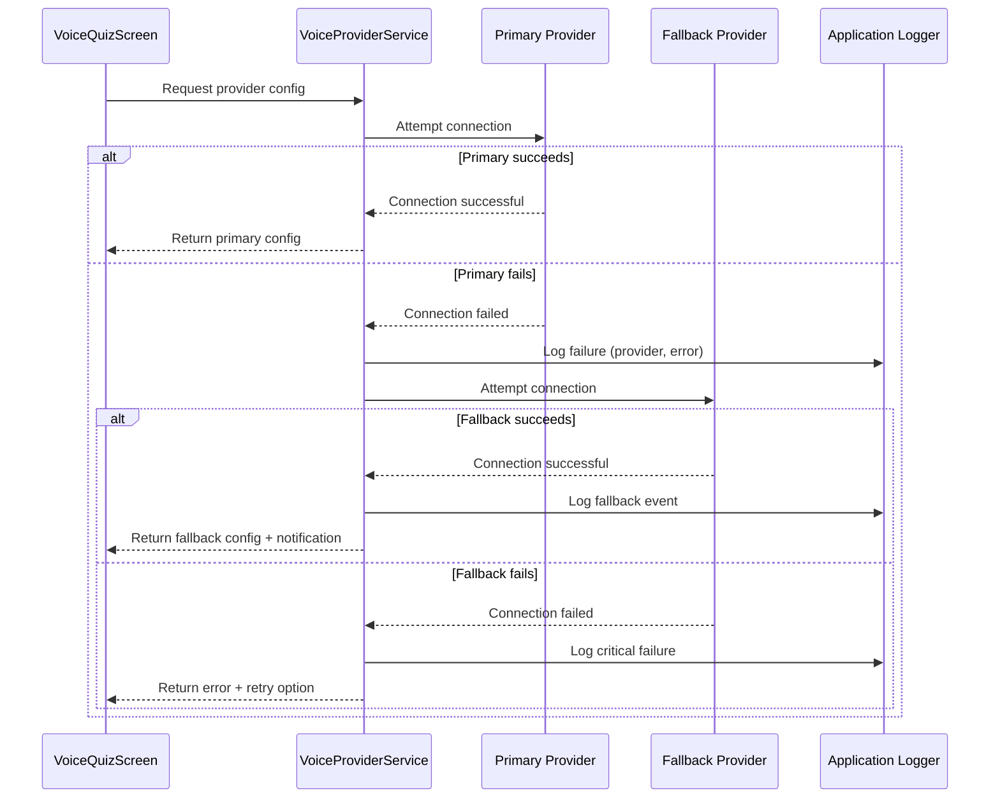

# Design Document: Gemini Voice Agent

## Overview

This design introduces multi-provider voice support for the AI Flashcard Quizzer, enabling dynamic switching between ElevenLabs and Gemini 2.5 Flash Native Audio providers. Firebase Remote Config controls provider selection at runtime, supporting A/B testing, gradual rollouts, and instant failover without code deployments.

The architecture maintains backward compatibility with existing ElevenLabs integration while introducing a provider abstraction layer that normalizes differences between voice services. The frontend VoiceQuizScreen remains unchanged from a user perspective, with provider-specific logic encapsulated in adapter classes.

### Key Design Goals

1. **Provider Abstraction**: Unified interface for multiple voice providers
2. **Dynamic Configuration**: Runtime provider selection via Firebase Remote Config
3. **Graceful Degradation**: Automatic fallback when primary provider fails
4. **Zero User Impact**: Consistent UX regardless of active provider
5. **Backward Compatibility**: Existing ElevenLabs functionality preserved

## Architecture

### System Components

```
┌─────────────────────────────────────────────────────────────────┐
│                        VoiceQuizScreen                          │
│                    (React Component)                            │
└────────────────────────────┬────────────────────────────────────┘
                             │
                             ▼
┌─────────────────────────────────────────────────────────────────┐
│                    Frontend Voice Service                       │
│                  (voiceService.js)                              │
└────────────────────────────┬────────────────────────────────────┘
                             │ HTTP GET /api/quiz/speech-token
                             ▼
┌─────────────────────────────────────────────────────────────────┐
│                   API Route Handler                             │
│            /api/quiz/speech-token/route.js                      │
└────────────────────────────┬────────────────────────────────────┘
                             │
                             ▼
┌─────────────────────────────────────────────────────────────────┐
│                  Voice Provider Service                         │
│              (voiceProviderService.js)                          │
│                                                                 │
│  ┌──────────────────────────────────────────────────────────┐  │
│  │         Firebase Remote Config Client                    │  │
│  │  - Fetch provider selection                              │  │
│  │  - Cache with TTL (1 hour)                               │  │
│  │  - Percentage rollouts                                   │  │
│  │  - User targeting                                        │  │
│  └──────────────────────────────────────────────────────────┘  │
│                                                                 │
│  ┌──────────────────────────────────────────────────────────┐  │
│  │         Provider Factory                                 │  │
│  │  - Select provider based on config                       │  │
│  │  - Instantiate provider adapter                          │  │
│  │  - Handle fallback logic                                 │  │
│  └──────────────────────────────────────────────────────────┘  │
└────────────────────────────┬────────────────────────────────────┘
                             │
                ┌────────────┴────────────┐
                ▼                         ▼
┌───────────────────────────┐  ┌──────────────────────────┐
│  ElevenLabs Provider      │  │  Gemini Provider         │
│  (elevenlabsProvider.js)  │  │  (geminiProvider.js)     │
│                           │  │                          │
│  - getSignedUrl()         │  │  - getSignedUrl()        │
│  - startSession()         │  │  - startSession()        │
│  - endSession()           │  │  - endSession()          │
│  - sendMessage()          │  │  - sendMessage()         │
│  - setMicMuted()          │  │  - setMicMuted()         │
└───────────────────────────┘  └──────────────────────────┘
                │                          │
                ▼                          ▼
┌───────────────────────────┐  ┌──────────────────────────┐
│  ElevenLabs Agent API     │  │  Gemini 2.5 Flash        │
│  (WebSocket)              │  │  Native Audio API        │
│                           │  │  (WebSocket)             │
└───────────────────────────┘  └──────────────────────────┘
```

### Component Responsibilities

**VoiceQuizScreen (Frontend)**
- Renders voice quiz UI
- Manages quiz session state
- Handles user interactions (mute, end session, feedback)
- Provider-agnostic implementation

**Frontend Voice Service**
- Fetches provider configuration from backend
- Returns provider details to VoiceQuizScreen
- Thin wrapper around API client

**API Route Handler**
- Receives speech token requests
- Delegates to Voice Provider Service
- Returns provider configuration and credentials

**Voice Provider Service (Backend)**
- Queries Firebase Remote Config
- Implements caching with TTL
- Selects appropriate provider
- Handles fallback logic
- Logs provider selection decisions

**Provider Adapters**
- Implement unified interface
- Handle provider-specific authentication
- Normalize events and responses
- Manage WebSocket connections

### Firebase Remote Config Integration

Firebase Remote Config stores provider selection parameters and enables runtime configuration changes without deployments.

**Configuration Parameters:**

```javascript
{
  "voice_provider_selection": {
    "defaultValue": "elevenlabs",
    "conditionalValues": {
      "gemini_rollout_20": {
        "condition": "percent(20)",
        "value": "gemini"
      },
      "gemini_beta_users": {
        "condition": "user.in_segment('beta_testers')",
        "value": "gemini"
      }
    }
  },
  "voice_provider_fallback": {
    "defaultValue": "elevenlabs"
  },
  "voice_config_cache_ttl_seconds": {
    "defaultValue": 3600
  }
}
```

**Remote Config Client Initialization:**

The backend initializes Firebase Remote Config during application startup:

```javascript
// backend/lib/firebase/remoteConfig.js
import { initializeAdmin } from './admin.js';

let remoteConfigClient;

export function getRemoteConfig() {
  if (remoteConfigClient) {
    return remoteConfigClient;
  }
  
  const app = initializeAdmin();
  remoteConfigClient = app.remoteConfig();
  return remoteConfigClient;
}
```

**Caching Strategy:**

- In-memory cache with configurable TTL (default 1 hour)
- Cache key: `voice_provider_config`
- Cache invalidation on TTL expiry
- Fallback to cached value if Remote Config fetch fails

### Provider Selection Flow



### Fallback Mechanism Flow



## Components and Interfaces

### Voice Provider Interface

All provider adapters implement this interface:

```javascript
/**
 * Base interface for voice providers
 */
class VoiceProvider {
  /**
   * Get provider name
   * @returns {string} Provider identifier
   */
  getName() {
    throw new Error('Not implemented');
  }

  /**
   * Get signed URL for WebSocket connection
   * @returns {Promise<string>} Signed URL
   */
  async getSignedUrl() {
    throw new Error('Not implemented');
  }

  /**
   * Get provider capabilities
   * @returns {Object} Capability flags
   */
  getCapabilities() {
    return {
      supportsFeedback: false,
      supportsMute: false,
      supportsContextualUpdates: false,
    };
  }

  /**
   * Validate provider credentials
   * @returns {Promise<boolean>} True if credentials are valid
   */
  async validateCredentials() {
    throw new Error('Not implemented');
  }

  /**
   * Get provider-specific configuration for frontend
   * @returns {Object} Frontend configuration
   */
  getFrontendConfig() {
    throw new Error('Not implemented');
  }
}
```

### ElevenLabs Provider Adapter

```javascript
/**
 * ElevenLabs voice provider implementation
 */
class ElevenLabsProvider extends VoiceProvider {
  constructor(apiKey, agentId) {
    super();
    this.apiKey = apiKey;
    this.agentId = agentId;
  }

  getName() {
    return 'elevenlabs';
  }

  async getSignedUrl() {
    const response = await fetch(
      `https://api.elevenlabs.io/v1/convai/conversation/get-signed-url?agent_id=${this.agentId}`,
      {
        method: 'GET',
        headers: {
          'xi-api-key': this.apiKey,
        },
      }
    );

    if (!response.ok) {
      throw new Error(`ElevenLabs API error: ${response.statusText}`);
    }

    const body = await response.json();
    return body.signed_url;
  }

  getCapabilities() {
    return {
      supportsFeedback: true,
      supportsMute: true,
      supportsContextualUpdates: true,
    };
  }

  async validateCredentials() {
    if (!this.apiKey || !this.agentId) {
      return false;
    }
    try {
      await this.getSignedUrl();
      return true;
    } catch (error) {
      return false;
    }
  }

  getFrontendConfig() {
    return {
      provider: 'elevenlabs',
      connectionType: 'websocket',
      clientLibrary: '@elevenlabs/client',
    };
  }
}
```

### Gemini Provider Adapter

```javascript
/**
 * Gemini 2.5 Flash Native Audio provider implementation
 */
class GeminiProvider extends VoiceProvider {
  constructor(apiKey, projectId) {
    super();
    this.apiKey = apiKey;
    this.projectId = projectId;
  }

  getName() {
    return 'gemini';
  }

  async getSignedUrl() {
    // Gemini uses API key authentication, not signed URLs
    // Return WebSocket endpoint with embedded credentials
    const endpoint = `wss://generativelanguage.googleapis.com/v1beta/models/gemini-2.5-flash:streamGenerateContent`;
    return `${endpoint}?key=${this.apiKey}`;
  }

  getCapabilities() {
    return {
      supportsFeedback: false,
      supportsMute: true,
      supportsContextualUpdates: true,
    };
  }

  async validateCredentials() {
    if (!this.apiKey || !this.projectId) {
      return false;
    }
    // Validate by making a test API call
    try {
      const response = await fetch(
        `https://generativelanguage.googleapis.com/v1beta/models/gemini-2.5-flash?key=${this.apiKey}`,
        { method: 'GET' }
      );
      return response.ok;
    } catch (error) {
      return false;
    }
  }

  getFrontendConfig() {
    return {
      provider: 'gemini',
      connectionType: 'websocket',
      clientLibrary: '@google/generative-ai',
      model: 'gemini-2.5-flash',
    };
  }
}
```

### Voice Provider Service

```javascript
/**
 * Service for managing voice provider selection and configuration
 */
class VoiceProviderService {
  constructor() {
    this.cache = new Map();
    this.cacheTTL = 3600000; // 1 hour in milliseconds
  }

  /**
   * Get provider configuration from Remote Config
   * @param {string} userId - Optional user ID for targeting
   * @returns {Promise<Object>} Provider configuration
   */
  async getProviderConfig(userId = null) {
    const cacheKey = `voice_provider_config_${userId || 'default'}`;
    const cached = this.cache.get(cacheKey);

    if (cached && Date.now() - cached.timestamp < this.cacheTTL) {
      return cached.config;
    }

    try {
      const remoteConfig = getRemoteConfig();
      const template = await remoteConfig.getTemplate();
      
      const providerSelection = template.parameters.voice_provider_selection?.defaultValue?.value || 'elevenlabs';
      const fallbackProvider = template.parameters.voice_provider_fallback?.defaultValue?.value || 'elevenlabs';
      const cacheTTL = parseInt(template.parameters.voice_config_cache_ttl_seconds?.defaultValue?.value || '3600');

      const config = {
        provider: providerSelection,
        fallback: fallbackProvider,
        cacheTTL: cacheTTL * 1000,
      };

      this.cache.set(cacheKey, {
        config,
        timestamp: Date.now(),
      });

      return config;
    } catch (error) {
      console.error('Failed to fetch Remote Config:', error);
      
      // Return cached value if available
      if (cached) {
        console.warn('Using stale cached config due to Remote Config failure');
        return cached.config;
      }

      // Ultimate fallback
      return {
        provider: process.env.VOICE_PROVIDER_DEFAULT || 'elevenlabs',
        fallback: 'elevenlabs',
        cacheTTL: this.cacheTTL,
      };
    }
  }

  /**
   * Create provider instance based on configuration
   * @param {string} providerName - Provider identifier
   * @returns {VoiceProvider} Provider instance
   */
  createProvider(providerName) {
    switch (providerName) {
      case 'elevenlabs':
        return new ElevenLabsProvider(
          process.env.ELEVENLABS_API_KEY,
          process.env.ELEVENLABS_AGENT_ID
        );
      case 'gemini':
        return new GeminiProvider(
          process.env.GEMINI_API_KEY,
          process.env.GEMINI_PROJECT_ID
        );
      default:
        throw new Error(`Unknown provider: ${providerName}`);
    }
  }

  /**
   * Get provider with fallback support
   * @param {string} userId - Optional user ID
   * @returns {Promise<Object>} Provider instance and metadata
   */
  async getProvider(userId = null) {
    const config = await this.getProviderConfig(userId);
    
    try {
      const provider = this.createProvider(config.provider);
      const isValid = await provider.validateCredentials();
      
      if (isValid) {
        console.log(`Using primary provider: ${config.provider}`);
        return {
          provider,
          isPrimary: true,
          fallbackOccurred: false,
        };
      }
      
      throw new Error(`Provider ${config.provider} credentials invalid`);
    } catch (error) {
      console.error(`Primary provider ${config.provider} failed:`, error);
      
      // Attempt fallback
      try {
        const fallbackProvider = this.createProvider(config.fallback);
        const isValid = await fallbackProvider.validateCredentials();
        
        if (isValid) {
          console.warn(`Falling back to provider: ${config.fallback}`);
          return {
            provider: fallbackProvider,
            isPrimary: false,
            fallbackOccurred: true,
            fallbackReason: error.message,
          };
        }
        
        throw new Error(`Fallback provider ${config.fallback} credentials invalid`);
      } catch (fallbackError) {
        console.error(`Fallback provider ${config.fallback} failed:`, fallbackError);
        throw new Error('All voice providers unavailable');
      }
    }
  }
}

export const voiceProviderService = new VoiceProviderService();
```

### API Route Modifications

The `/api/quiz/speech-token` endpoint is modified to return provider-specific configuration:

```javascript
/**
 * GET /api/quiz/speech-token
 * Returns provider configuration and signed URL for voice session
 */
import { apiHandler } from '@/lib/api/middleware.js';
import { errorResponse, successResponse } from '@/lib/api/errorHandler.js';
import { voiceProviderService } from '@/lib/services/voiceProviderService.js';

export const GET = apiHandler(async (request) => {
  try {
    // Extract user ID from session if available
    const userId = request.user?.id || null;
    
    const { provider, isPrimary, fallbackOccurred, fallbackReason } = 
      await voiceProviderService.getProvider(userId);
    
    const signedUrl = await provider.getSignedUrl();
    const capabilities = provider.getCapabilities();
    const frontendConfig = provider.getFrontendConfig();
    
    return successResponse({
      provider: provider.getName(),
      signedUrl,
      capabilities,
      config: frontendConfig,
      fallbackOccurred,
      fallbackReason: fallbackOccurred ? fallbackReason : undefined,
    });
  } catch (error) {
    console.error('Error getting voice provider:', error);
    return errorResponse('Failed to initialize voice provider', 500);
  }
});
```

### Frontend Adapter Pattern

The VoiceQuizScreen uses a provider-agnostic approach by dynamically loading the appropriate client library:

```javascript
// frontend/src/services/voiceService.js (updated)
import { apiClient } from './apiClient'

export const voiceService = {
  /**
   * Get provider configuration from backend
   * @returns {Promise<Object>} Provider configuration
   */
  async getProviderConfig() {
    const data = await apiClient.get('/api/quiz/speech-token')
    return {
      provider: data.provider,
      signedUrl: data.signedUrl,
      capabilities: data.capabilities,
      config: data.config,
      fallbackOccurred: data.fallbackOccurred,
      fallbackReason: data.fallbackReason,
    }
  },

  /**
   * Start voice session with appropriate provider
   * @param {Object} providerConfig - Configuration from getProviderConfig()
   * @param {Object} callbacks - Event callbacks
   * @returns {Promise<Object>} Session instance
   */
  async startSession(providerConfig, callbacks) {
    if (providerConfig.provider === 'elevenlabs') {
      return this.startElevenLabsSession(providerConfig, callbacks)
    } else if (providerConfig.provider === 'gemini') {
      return this.startGeminiSession(providerConfig, callbacks)
    } else {
      throw new Error(`Unknown provider: ${providerConfig.provider}`)
    }
  },

  /**
   * Start ElevenLabs session
   */
  async startElevenLabsSession(config, callbacks) {
    const { Conversation } = await import('@elevenlabs/client')
    
    const conversation = await Conversation.startSession({
      signedUrl: config.signedUrl,
      connectionType: 'websocket',
      onConnect: callbacks.onConnect,
      onDisconnect: callbacks.onDisconnect,
      onMessage: callbacks.onMessage,
      onError: callbacks.onError,
      onStatusChange: callbacks.onStatusChange,
      onModeChange: callbacks.onModeChange,
      onCanSendFeedbackChange: callbacks.onCanSendFeedbackChange,
    })

    return {
      conversation,
      provider: 'elevenlabs',
      endSession: () => conversation.endSession(),
      sendMessage: (msg) => conversation.sendUserMessage(msg),
      sendContextualUpdate: (ctx) => conversation.sendContextualUpdate(ctx),
      setMicMuted: (muted) => conversation.setMicMuted(muted),
      sendFeedback: (positive) => conversation.sendFeedback(positive),
      getId: () => conversation.getId(),
    }
  },

  /**
   * Start Gemini session
   */
  async startGeminiSession(config, callbacks) {
    const { GoogleGenerativeAI } = await import('@google/generative-ai')
    
    // Extract API key from signed URL
    const url = new URL(config.signedUrl)
    const apiKey = url.searchParams.get('key')
    
    const genAI = new GoogleGenerativeAI(apiKey)
    const model = genAI.getGenerativeModel({ model: config.config.model })
    
    // Create WebSocket connection for streaming
    const ws = new WebSocket(config.signedUrl)
    
    ws.onopen = () => {
      callbacks.onConnect?.()
    }
    
    ws.onclose = () => {
      callbacks.onDisconnect?.()
    }
    
    ws.onerror = (error) => {
      callbacks.onError?.(error)
    }
    
    ws.onmessage = (event) => {
      const data = JSON.parse(event.data)
      
      if (data.type === 'user-message') {
        callbacks.onMessage?.({ type: 'user-message', text: data.text })
      } else if (data.type === 'agent-message') {
        callbacks.onMessage?.({ type: 'agent-message', text: data.text })
      }
      
      if (data.mode) {
        callbacks.onModeChange?.(data.mode)
      }
    }
    
    return {
      ws,
      model,
      provider: 'gemini',
      endSession: () => ws.close(),
      sendMessage: (msg) => {
        ws.send(JSON.stringify({ type: 'user-message', text: msg }))
      },
      sendContextualUpdate: (ctx) => {
        ws.send(JSON.stringify({ type: 'context-update', context: ctx }))
      },
      setMicMuted: (muted) => {
        ws.send(JSON.stringify({ type: 'mute', muted }))
      },
      sendFeedback: () => {
        // Gemini doesn't support feedback
        console.warn('Feedback not supported by Gemini provider')
      },
      getId: () => `gemini-${Date.now()}`,
    }
  },
}
```

## Data Models

### Provider Configuration (Remote Config)

```javascript
{
  "voice_provider_selection": {
    "type": "string",
    "enum": ["elevenlabs", "gemini", "auto"],
    "default": "elevenlabs",
    "description": "Active voice provider for quiz sessions"
  },
  "voice_provider_fallback": {
    "type": "string",
    "enum": ["elevenlabs", "gemini"],
    "default": "elevenlabs",
    "description": "Fallback provider when primary fails"
  },
  "voice_config_cache_ttl_seconds": {
    "type": "number",
    "default": 3600,
    "description": "Cache TTL for provider configuration in seconds"
  }
}
```

### API Response Schema

```javascript
// GET /api/quiz/speech-token response
{
  "provider": "elevenlabs" | "gemini",
  "signedUrl": "wss://...",
  "capabilities": {
    "supportsFeedback": boolean,
    "supportsMute": boolean,
    "supportsContextualUpdates": boolean
  },
  "config": {
    "provider": string,
    "connectionType": "websocket",
    "clientLibrary": string,
    "model": string (optional, for Gemini)
  },
  "fallbackOccurred": boolean,
  "fallbackReason": string (optional)
}
```

### Environment Variables

```bash
# ElevenLabs Configuration
ELEVENLABS_API_KEY=sk_...
ELEVENLABS_AGENT_ID=agent_...

# Gemini Configuration
GEMINI_API_KEY=AIza...
GEMINI_PROJECT_ID=project-id

# Firebase Remote Config
FIREBASE_REMOTE_CONFIG_ENABLED=true

# Development Override
VOICE_PROVIDER_DEFAULT=elevenlabs
```


## Correctness Properties

*A property is a characteristic or behavior that should hold true across all valid executions of a system—essentially, a formal statement about what the system should do. Properties serve as the bridge between human-readable specifications and machine-verifiable correctness guarantees.*

Before defining the correctness properties, I'll analyze each acceptance criterion from the requirements to determine testability.


### Property 1: Provider Interface Compatibility

*For any* voice provider implementation (ElevenLabs or Gemini), the provider SHALL implement all required interface methods: getName(), getSignedUrl(), getCapabilities(), validateCredentials(), and getFrontendConfig().

**Validates: Requirements 1.5, 3.2**

### Property 2: Speech Synthesis Round Trip

*For any* quiz question text and voice provider, synthesizing the text to audio and then transcribing it back SHALL produce semantically equivalent text.

**Validates: Requirements 1.1, 1.2, 1.6, 1.7**

### Property 3: WebSocket Connection Establishment

*For any* voice quiz session start request with a valid provider, the system SHALL establish a WebSocket connection and return a connected state.

**Validates: Requirements 1.3**

### Property 4: Context Initialization After Connection

*For any* established Gemini provider connection, sending quiz context SHALL occur before any quiz questions are generated.

**Validates: Requirements 1.4**

### Property 5: Remote Config Cache Behavior

*For any* two consecutive provider configuration requests within the cache TTL period, the second request SHALL return the cached value without fetching from Remote Config.

**Validates: Requirements 2.7**

### Property 6: Remote Config Fallback on Failure

*For any* Remote Config fetch failure, if a cached value exists, the system SHALL use it; otherwise, the system SHALL default to the VOICE_PROVIDER_DEFAULT environment variable or "elevenlabs".

**Validates: Requirements 2.8**

### Property 7: Provider Factory Selection

*For any* valid provider name ("elevenlabs" or "gemini") from Remote Config, the Voice_Adapter factory SHALL return an instance of the corresponding provider class.

**Validates: Requirements 3.1, 3.3**

### Property 8: Response Normalization

*For any* provider-specific response format, the Voice_Adapter SHALL transform it into the standardized response format containing provider, signedUrl, capabilities, and config fields.

**Validates: Requirements 3.4, 4.3**

### Property 9: Method Delegation

*For any* Voice_Adapter method call (getSignedUrl, validateCredentials, etc.), the call SHALL be delegated to the corresponding method of the selected provider implementation.

**Validates: Requirements 3.6**

### Property 10: Provider Authentication Before Connection

*For any* provider initialization, credential validation SHALL complete successfully before any WebSocket connection attempt.

**Validates: Requirements 3.7**

### Property 11: API Response Structure Completeness

*For any* successful /api/quiz/speech-token request, the response SHALL contain all required fields: provider, signedUrl, capabilities, config, and fallbackOccurred.

**Validates: Requirements 4.1, 4.6**

### Property 12: Primary Provider Fallback on Failure

*For any* primary provider connection failure, the system SHALL attempt connection with the fallback provider before returning an error.

**Validates: Requirements 5.1**

### Property 13: Fallback Notification

*For any* successful fallback to an alternative provider, the API response SHALL include fallbackOccurred: true and a fallbackReason describing the primary failure.

**Validates: Requirements 5.4, 5.7**

### Property 14: Failure Logging Completeness

*For any* provider connection failure, the system SHALL log an entry containing timestamp, provider name, error message, and user context (if available).

**Validates: Requirements 5.3, 9.1, 9.2**

### Property 15: Dynamic Provider Library Loading

*For any* provider configuration returned from the API, the frontend SHALL dynamically import the correct client library (@elevenlabs/client for ElevenLabs, @google/generative-ai for Gemini).

**Validates: Requirements 6.2, 6.3**

### Property 16: Provider Event Normalization

*For any* provider-specific event (connection, disconnection, message, error), the frontend SHALL transform it into the standardized event format used by VoiceQuizScreen.

**Validates: Requirements 6.6**

### Property 17: UI Provider Independence

*For any* active voice provider, the VoiceQuizScreen SHALL render the same UI components and structure, with only provider-specific capabilities affecting available features (e.g., feedback button visibility).

**Validates: Requirements 6.7**

### Property 18: Credential Validation for Selected Provider

*For any* provider selection, the system SHALL validate that all required environment variables for that provider are present and non-empty before attempting connection.

**Validates: Requirements 7.6**

### Property 19: Missing Credentials Error Response

*For any* provider selection with missing required credentials, the /api/quiz/speech-token endpoint SHALL return a 500 status code with an error message specifying which credentials are missing.

**Validates: Requirements 7.7**

### Property 20: Remote Config Fetch Logging

*For any* Remote Config fetch operation, the system SHALL log an entry indicating whether the operation was a cache hit, cache miss, successful fetch, or failed fetch.

**Validates: Requirements 9.3**

### Property 21: Session Metrics Logging

*For any* completed voice quiz session, the system SHALL log session duration, message count, provider name, and user ID (if available).

**Validates: Requirements 9.6**

### Property 22: Provider Name in Voice Logs

*For any* log entry related to voice operations (connection, message, error, session), the log SHALL include the provider name as a field.

**Validates: Requirements 9.5**

